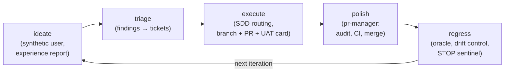

# kitchenloop

**An autonomous product-building loop for Claude Code: ideate → triage → execute → polish → regress, every iteration in an isolated git worktree, every merge behind gates enforced by plain shell — outside the model's reach.**

```
$ ./scripts/kitchenloop/kitchenloop.sh 5      # five unattended iterations
```

KitchenLoop points an agent at your repo and lets it *use* your product the way
a user would, convert the friction it hits into tickets, implement the top
tickets through spec-driven development, and merge only what survives a gauntlet
of gates — a deterministic test oracle, a quality bar, an adversarial PR audit
(with an **optional cross-model Codex/Gemini review** — no model reviews its own
work), and a zero-context UAT evaluator that re-tests the sealed test card with
no idea how the code was written. Then again. Unattended, overnight, for days.

## Motivation

This is a working implementation of the loop described in:

> Roy, Y. *The Kitchen Loop: User-Spec-Driven Development for a Self-Evolving
> Codebase.* arXiv:2603.25697, March 2026.
> [abstract](https://arxiv.org/abs/2603.25697) · [pdf](https://arxiv.org/pdf/2603.25697) ([CC BY 4.0](https://creativecommons.org/licenses/by/4.0/))

The paper's trust model maps directly onto this harness:

| Paper concept | Here |
| --- | --- |
| Specification surface | `kitchenloop.yaml` `spec.dimensions` — the feature × platform × user-type grid the loop must cover, with `spec.blocked` as the owner-gated roadmap fence |
| "As a User × 1000" | the **ideate** phase: a synthetic user picks a scenario, actually implements and runs it against the public surface, and files an experience report |
| Unbeatable Tests | `.kitchenloop/unbeatable-tests.md` — the 4-layer verification pattern (compile / execute / parse / state-delta) the code author cannot fake, plus the UAT gate's zero-context evaluator |
| Drift Control | the **regress** phase: pass-rate floors, test-count-decline detection, and a STOP sentinel that freezes the loop for the owner |

What this implementation adds on top of the paper: **spec-driven development
routing** (feature-sized tickets go through
[GitHub's Spec Kit](https://github.com/github/spec-kit): specify → plan → tasks
→ implement, with a constitution check on every plan), a **gated merge
pipeline** (`scripts/pr-manager/`) with an adversarial read-only PR auditor, an
**escalation protocol** (the loop files asks it cannot decide and keeps
working — a gate not recorded in ESCALATIONS.md has not actually been asked), **worktree isolation**
per iteration, drain mode, a periodic **quality sweep**, an automated
**loop-review** every few iterations, and an owner-invoked **loop-review-meta**
skill that scores the loop's own self-improvement across review periods.
The loop evolves the product *and* its own backlog discipline.

## A real run — a PRD in, a working product out

The numbers below are from this harness's first production outing. The **only**
seed was a **product requirements document** (dropped in as `spec.docs`) and a
one-page constitution — no app code. From that empty repository the loop
scaffolded, built, and shipped a full-stack product (kept private), with the
owner doing nothing but answer escalations:

- **0 → 1 from a PRD**: an empty repo + a spec document to a running MVP
- in an estimated **~35–40 hours of agent time** — a work-week of compute, not
  the ~2-week calendar span it was spread over (measured from the driver logs;
  run in short unattended bursts, hand-restarted after crashes and lid-closes,
  so treat it as an estimate rather than a stopwatch figure)
- **21 loop iterations** plus 20 goal-driver runs, **195 commits**, **77 merged PRs**
- test suite grown **172 → 606 passing**, with the regression oracle's 0.95
  pass-rate floor never breached across the run
- self-scored **2/10 → "10/10 GOAL MET"** on its four required features

The PRD is what the ideate and execute phases read to know *what* to build; the
constitution is what every plan is checked against. Point the loop at your own
spec documents via `spec.docs` in `kitchenloop.yaml`.

The product stays private; what's published here is the harness that built it.
Patterns only — no code, data, or names from anything I have operated
professionally.

## How an iteration runs



- **Every iteration is a fresh worktree** on a `kitchen/iter-N` branch — the
  loop never works on your checkout.
- **Judgment and enforcement are split.** Agents write code and prose; the
  driver (`kitchenloop.sh`, plain bash) enforces the gates mechanically:
  timeouts, the regression oracle, protected paths, merge preconditions, the
  STOP sentinel. An agent cannot talk its way past a gate the shell enforces.
- **The owner steers through files, not chats.** `MANDATE.md` is the standing
  mandate (under ten lines, read at the start of every phase, only the owner
  edits it). `ESCALATIONS.md` is where the loop files asks it cannot decide.
  `.kitchenloop/STOP` freezes everything.
- **Honesty rules.** Live verification that silently skips is a review-blocking
  violation; allowlisting a real error line is assertion-weakening; an
  unexercised check is reported as not-run, never as passing.

## The review tribunal — bring your own reviewers

Every PR is code-reviewed before it can merge. The reviewer set is **configurable
to the subscriptions you have**:

- **Claude `pr-auditor` (always on).** A built-in adversarial reviewer
  (`.claude/agents/pr-auditor.md`) that checks code ↔ spec ↔ architecture
  alignment. It needs nothing beyond the Claude subscription the loop already
  runs on — so **a single-subscription (Claude-only) setup works out of the
  box**, merging on the pr-auditor's `APPROVE`.
- **Codex (optional, `reviewers.codex.enabled`).** Adds a second, independent,
  *cross-vendor* review — no model reviews its own work. When enabled it is a
  hard merge gate (the pipeline goes `STUCK` rather than merge if codex is
  unavailable); when disabled it is simply skipped.
- **Gemini (optional, `reviewers.gemini.enabled`).** A third independent
  reviewer on the same footing.

Have one subscription? Run Claude-only. Have two (e.g. Claude + Codex)? Enable
codex for a genuine cross-model tribunal. The gate is never weaker than one
adversarial reviewer, and as strong as the models you seat.

## Full setup

Prerequisites:
- **[Claude Code](https://claude.com/claude-code) CLI** — drives every phase; one
  Claude subscription is all the loop needs to run.
- **`git`, `gh`** (authenticated), **`jq`, `yq`**, **Node ≥ 20** (the coverage
  deriver and the default oracle are Node), and **`pnpm`** (the regress gate's
  dependency install assumes pnpm by default — adapt for your stack).
- **Docker** — needed for real feature work: the UAT gate and Live Test & Fix
  boot your app (`docker compose up`) to verify against a live stack. Without it,
  those gates record `SKIPPED` instead of passing.
- **Playwright MCP** — the UAT evaluator and Live Test & Fix drive a browser
  through it for UI journeys (not needed for API-only products).
- **Optional external reviewers** — `codex` and/or `gemini` CLI (see *The review
  tribunal* above). Neither is required; enable whichever you have.

**1. Vendor the harness into your repo:**

```bash
git clone https://github.com/HassaanSaleem/kitchenloop.git /tmp/kitchenloop
cd your-project
cp -R /tmp/kitchenloop/scripts /tmp/kitchenloop/.claude /tmp/kitchenloop/.specify .
mkdir -p .kitchenloop docs/internal/reports memory .github/workflows
cp /tmp/kitchenloop/.kitchenloop/*.md /tmp/kitchenloop/.kitchenloop/*.yaml .kitchenloop/
cp /tmp/kitchenloop/kitchenloop.example.yaml .
cp /tmp/kitchenloop/MANDATE.md /tmp/kitchenloop/ESCALATIONS.md /tmp/kitchenloop/.env.example .
cp /tmp/kitchenloop/.github/workflows/ci.yml .github/workflows/   # or bring your own CI
# Vendor only the runtime-state ignores — NOT the harness-repo-only block at the
# bottom of kitchenloop's .gitignore (it ignores specs/ and the constitution you
# create in step 2). Copy the marked section, or hand-pick the lines you want.
sed -n '/^# --- runtime state/,/^# --- end runtime state/p' /tmp/kitchenloop/.gitignore >> .gitignore
```

Two things the loop's own tooling needs in your `package.json`: a `test`/`lint`
script your oracle can call, and — if you keep the vendored coverage test —
`vitest` as a devDependency (see this repo's `package.json`). Then adapt `ci.yml`
to your test/lint commands (the `pr_manager.require_ci` gate expects it) and copy
`kitchenloop.example.yaml` → `kitchenloop.yaml` (step 3).

**2. Initialize spec-driven development.** The execute phase routes
feature-sized tickets through Spec Kit, which needs a project constitution:

```
claude
> /speckit-constitution    # interactive: your project's immutable principles
```

**3. Configure the loop.** Copy `kitchenloop.example.yaml` to
`kitchenloop.yaml` and fill in the four things that matter most:

- `project.context` — what the product is and what a real user session looks
  like (the ideate phase becomes this user)
- `spec.dimensions` — the feature × platform × user-type surface to cover, and
  `spec.blocked` for roadmap phases the loop must not touch yet
- `verification.oracle` — your lint/test/smoke commands (any language; the
  defaults assume Node)
- `verification.live` — commands to boot and exercise the built app, or empty
  strings to record live verification as explicitly SKIPPED

**4. Write your `MANDATE.md`** (template included): what the loop may do
autonomously, and the ALWAYS-STOP list it must escalate.

**5. Adapt the two doctrine files** in `.kitchenloop/`: `quality-bar.md` (the
merge bar) and `unbeatable-tests.md` (the verification pattern), plus
`.env.example` → `.env` if you want Slack pings on escalations.

**6. Run it:**

```bash
./scripts/kitchenloop/kitchenloop.sh 1                 # one supervised iteration
./scripts/kitchenloop/kitchenloop.sh 10                # ten, unattended
./scripts/kitchenloop/kitchenloop.sh 1 --only polish   # just harden + merge open PRs
```

**Modes** (`--mode`): `strategy` (default — the full ideate→…→regress loop);
`user-only` rapidly fills the backlog (ideate + triage only); `dev-only` drains
it (execute + polish + regress); `backtest` exercises your test pipeline;
`exploration` hunts coverage gaps; `ui` runs one browser flow per iteration
(needs a `ui_tests` block in `kitchenloop.yaml` and Playwright MCP).

### Running it goal-directed inside Claude Code

The pattern from the real run above: give Claude Code the loop as a standing
goal and let it act as the driver —

```
> /goal keep running "caffeinate -i ./scripts/kitchenloop/kitchenloop.sh" until
  the demo journey works end to end; score progress /10 after each iteration
```

The driver session restarts the loop between iterations, reconciles finished
tickets, reprioritizes the backlog against the goal, and self-scores progress —
that is how the "2/10 → 10/10 in three days" milestone above was driven.

## The demo

[`kitchenloop-demo`](https://github.com/HassaanSaleem/kitchenloop-demo) is a
deliberately tiny note-taking service (for Relay, the same fictional company as
my other showcase repos) seeded with a green suite and pointed at this harness.
Everything past its seed commit is loop-made — the
[iteration branches](https://github.com/HassaanSaleem/kitchenloop-demo/branches),
tickets, PRs, and merges are the loop's own work, visible in the open.
[`docs/demo-run.md`](docs/demo-run.md) captures the iterations end to end.

The demo host has no Docker and is API-only, so it runs a **reduced gate set** —
the deterministic oracle + the Claude pr-auditor (and codex, once enabled); the
Live Test & Fix and L3-boot gates record `SKIPPED`. `demo-run.md` says exactly
which gates ran in each capture, so the demo is never read as exercising the
full gauntlet.

## Layout

```
scripts/kitchenloop/
├── kitchenloop.sh        # the driver: phases, gates, worktrees, STOP sentinel
├── lib/                  # config loader, paths contract, ticket providers, notify
├── prompts/              # the ten phase prompts (ideate variants, triage, execute…)
└── derive-coverage.mjs   # scenario coverage-matrix deriver (+ tests)
scripts/pr-manager/       # gated merge pipeline: audit → CI → conflicts → merge
scripts/ai-discussion/    # structured multi-model debate (discussion-moderator skill)
.claude/skills/           # kitchenloop-* phase skills, loop-review, speckit-* (Spec Kit)
.claude/agents/           # pr-auditor (adversarial), uat-evaluator (zero-context)
.specify/                 # Spec Kit scripts + templates (vendored, see credits)
.kitchenloop/             # quality-bar.md, unbeatable-tests.md, blocked-combos.yaml
MANDATE.md                # template: the owner's standing mandate
ESCALATIONS.md            # template: the loop's asks, the owner's answers
kitchenloop.example.yaml  # fully-commented configuration template
```

## Credits

- **The Kitchen Loop** — Yannick Roy, [arXiv:2603.25697](https://arxiv.org/abs/2603.25697)
  (CC BY 4.0): the loop concept, the spec-surface/synthetic-user/unbeatable-tests/drift-control
  trust model, and this project's name.
- **[GitHub Spec Kit](https://github.com/github/spec-kit)** (MIT): the
  `speckit-*` skills and `.specify/` scripts/templates are vendored from
  spec-kit 0.12.4 essentially verbatim; the execute phase's SDD routing is
  built on them. No affiliation with either project.

## License

MIT — see [LICENSE](LICENSE).
